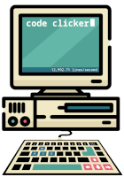
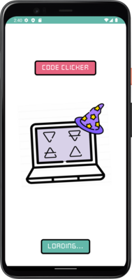
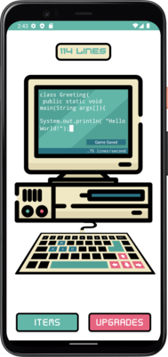
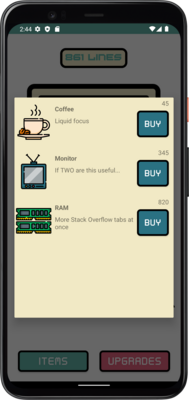
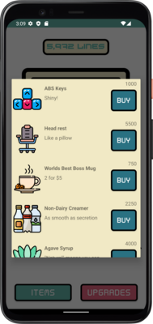

# code-clicker

Fun idle clicker with a coding theme.

## Features

- Casual, addictive gameplay
- 6 Generator items
- ~48 upgrade items
- Local saving via Android Room SQLite database

## Images

## Planning 

- [Models & wireframe](./readme-images/planning.png)

## Acknowledgements 

Code Clicker was created by:

- [Hambalieu Jallow](https://github.com/Hambalieu)
- [Robb Alexander](https://github.com/RobbMAlexander)
- [Tony Regalado](https://github.com/Edward-Regalado)
- [Ben Mills](https://github.com/akkanben)

Art assets for computer, items, and upgrades by [Flaticon](https://www.flaticon.com/)
